# Stock RAG MCP Suite

End-to-end demo project:

- **Server (Node.js + TypeScript)**: "MCP-style" tool server exposing REST endpoints, local RAG index, sentiment analysis, price prediction (SMA forecast), strategy analysis, scoring and buy/sell/hold recommendation, and backtesting. Uses SQLite via `better-sqlite3`.
- **Agent**: A lightweight rule-based agent that interprets natural-language prompts about a stock and calls the server's tools (sentiment, prediction, backtesting) + RAG retrieval to answer.
- **Frontend (Angular)**: Attractive, Material-styled dashboard to search a stock, trigger ingest, and view metrics/charts/recommendations.

> Notes
> - External market/news APIs are *optional*. If keys are not provided, the server falls back to sample data under `server/sample-data`.
> - "MCP-style": this repo implements an MCP-inspired tool server over HTTP/JSON with clearly declared tools and schemas. If you need strict **Model Context Protocol** (JSON-RPC over stdio/websocket), you can adapt `server/src/mcp/mcp-server.ts` which exposes a minimal MCP JSON-RPC tool surface.

## Architecture



- High-level diagram with components and data flow: `docs/architecture.md`
- The diagram is rendered with Mermaid; many IDEs and GitHub previewers support it.

## Quick Start

### 1) Prereqs
- Node.js 20+
- npm 10+
- (Optional) API keys if you want live data:
  - `ALPHA_VANTAGE_KEY` for prices
  - `NEWS_API_KEY` for headlines

### 2) Install & Run — Server
```bash
cd server
npm install
npm run dev
# or build & run
npm run build && npm start
```

The server listens on `http://localhost:4010` by default and initializes `stock.db` in the project root.

### 3) Install & Run — Frontend (Angular)
```bash
cd ../frontend
npm install
npm start
# Angular dev server: http://localhost:4200
```

### 4) Try it
1. Open the frontend: `http://localhost:4200`
2. Search for a symbol (e.g., `AAPL`), click **Ingest** to pull data (uses API keys if provided; otherwise sample data). Ingest now also indexes recent news into the RAG vector store for that symbol.
3. View overview, price chart, sentiment, RAG answers, strategy score, backtest & recommendation. Use the “Reindex Recent Sources” action to enrich RAG with Trendlyne/Yahoo summaries on demand.

### Environment
Create `server/.env` to enable live data:
```
PORT=4010
ALPHA_VANTAGE_KEY=your_alpha_vantage_key
NEWS_API_KEY=your_newsapi_key
```

For a full end-to-end setup (server + jobs + ML + frontend), see `docs/GETTING_STARTED.md`.

### Provider Ticker Mapping
The server resolves identifiers per provider using `server/stocklist.ts` and env-configurable rules. By default:

- Yahoo Finance: uses `symbol` with `.NS` suffix (e.g., `BEL` -> `BEL.NS`).
- News API: uses `name` (e.g., `Bharat Electronics`).
- AlphaVantage: uses `symbol` with no suffix.
 - Moneycontrol (MC Insights): uses `mcsymbol` with no suffix (e.g., `BEL` -> `BE03`).

Override via `server/.env` (examples shown commented in that file):

- `TICKER_YAHOO_KEY`: which key from `stocklist.ts` to use (e.g., `symbol`, `mcsymbol`, `isin`, `tlid`, `name`).
- `TICKER_YAHOO_SUFFIX`: suffix to append (e.g., `.NS`).
- `TICKER_NEWS_KEY`, `TICKER_NEWS_SUFFIX` for News API.
- `TICKER_ALPHA_KEY`, `TICKER_ALPHA_SUFFIX` for AlphaVantage.
- `TICKER_MC_KEY`, `TICKER_MC_SUFFIX` for Moneycontrol insights.
- `STOCKLIST_PATH`: explicit path to `stocklist.ts` if not in the default location.

Dynamic providers
- Any env var pair matching `TICKER_<PROVIDER>_KEY` (and optional `TICKER_<PROVIDER>_SUFFIX`) defines a new provider dynamically.
- These dynamic providers are discovered at runtime and exposed by the resolve APIs below.

Under the hood, the resolver maps any input (name/symbol/mcsymbol/isin/tlid) to the configured provider ticker. See `server/src/utils/ticker.ts`.

Examples
- Use NSE Yahoo suffix and News by name (defaults):
  - `TICKER_YAHOO_KEY=symbol`, `TICKER_YAHOO_SUFFIX=.NS`
  - `TICKER_NEWS_KEY=name`, `TICKER_NEWS_SUFFIX=`
- Use Moneycontrol mcsymbol BE03:
  - `TICKER_MC_KEY=mcsymbol`, `TICKER_MC_SUFFIX=`

### Resolve APIs

Introspect the provider mappings and resolve a given input (symbol/name/isin/mcsymbol/tlid) per provider.

- `GET /api/resolve/providers`
  - Lists all available providers (defaults + any discovered via env) and their resolution config.
  - Response example:
    ```json
    {
      "ok": true,
      "data": [
        { "provider": "alpha", "key": "symbol", "suffix": "" },
        { "provider": "mc", "key": "mcsymbol", "suffix": "" },
        { "provider": "news", "key": "name", "suffix": "" },
        { "provider": "trendlyne", "key": "tlid", "suffix": "" },
        { "provider": "yahoo", "key": "symbol", "suffix": ".NS" }
      ]
    }
    ```

## Providers Setup

This project integrates multiple market/news providers. All are optional — if a key or credential is missing, the server uses safe fallbacks (sample data where available).

- Yahoo Finance
  - No API key required; uses public endpoints with rotating bases and client headers.
  - Used for historical prices, quote summary modules, and charts.
  - Config: `TICKER_YAHOO_KEY` (default `symbol`), `TICKER_YAHOO_SUFFIX` (default `.NS`).

- Moneycontrol (Insights + Technicals)
  - No API key, but endpoints can be rate-limited or shape-shift occasionally.
  - Technicals used for indicators, pivots, SMA/EMA tables; Insights used for summary text and score.
  - Config: `TICKER_MC_KEY` (default `mcsymbol`).

- Trendlyne (SMA & Advanced Technicals)
  - Cookie-backed. You can supply credentials for headless refresh or a cookie string.
  - Env options:
    - `TRENDLYNE_EMAIL`, `TRENDLYNE_PASSWORD` for headless cookie refresh.
    - `TL_COOKIE` direct cookie, or `TL_COOKIE_URLS` (comma-separated) to fetch from a proxy endpoint.
    - `TL_COOKIE_CACHE_PATH` for on-disk cache.
  - A BullMQ job periodically caches TL SMA and Advanced Technicals in the `tl_cache` table. Read via:
    - `GET /api/tl-cache/by-symbol/:symbol?kind=sma|adv`
    - `GET /api/tl-cache/:tlid?kind=sma|adv`

- NewsAPI
  - Key: `NEWS_API_KEY` (https://newsapi.org/).
  - If missing or rate-limited (429), code falls back to sample news if `NEWS_FALLBACK_TO_SAMPLE_ON_429=true`.
  - Config: `TICKER_NEWS_KEY` (default `name`).

- AlphaVantage (optional fallback)
  - Key: `ALPHAVANTAGE_API_KEY`.
  - Used as an optional price fallback when Yahoo is unavailable.

### Jobs / Scheduling

BullMQ-based repeatable jobs are feature-flagged by `ENABLE_JOBS=true` and require Redis (`REDIS_URL`).

- Queues: `ingest:prices`, `ingest:news`, `ingest:tl`, `rag:reindex`, `top-picks:snapshot`, `features:build`.
- Cron envs: `CRON_PRICES`, `CRON_NEWS`, `CRON_TRENDLYNE`, `CRON_RAG`, `CRON_FEATURES`.
- Tuning: `JOB_BATCH`, `JOB_ATTEMPTS`, `JOB_BACKOFF_MS`, `JOB_CONCURRENCY_*` (per queue).
- Health: `GET /api/jobs/status` returns job metrics (runs, lastMs, avgMs).

## Frontend Features

The frontend (Vite + TypeScript cards) includes:

- Strategy Lab (Backtesting)
  - Run strategies (MA Crossover, Momentum) with parameters (fast/slow MAs), symbol list, date range.
  - Visuals: equity curve, drawdown chart, benchmark overlay (normalized close), metrics (Sharpe, MaxDD).
  - Export: equity series and metrics as JSON.

- Predictions
  - Triggers `/api/predict/:symbol` and displays model output and confidence when ML is enabled (`ENABLE_ML=true`).

- Provider & Jobs Health
  - A dedicated Health tab shows `/api/health/providers` and `/api/jobs/status` (runs, last latency, avg latency).

- Watchlist & Alerts
  - Watchlist with sortable table, sparklines, and basic metrics.
  - Alerts placeholder for defining rules on price/volume/RSI/sentiment.

### Stored Features API (UI consumption)

Use stored features to drive custom charts without recomputing via ML:

- `GET /api/features-stored/:symbol?days=60`
- `GET /api/features-stored/:symbol?from=YYYY-MM-DD&to=YYYY-MM-DD`

Response contains rows with `date, ret1, ret5, ret20, vol, rsi, sma20, ema50, momentum, sent_avg, pcr, pvr`.

### New (Provider Ingestion Enhancements)
- Automatic symbol fallback: If a provider run is triggered without an explicit symbol list (request or config), it now ingests the full stocklist (deduped).
- Batching: Set `INGEST_BATCH_SIZE` (or per-provider `defaultBatchSize`) to process symbols in chunks and persist a single aggregated run; batch timing + per-symbol average times are exposed in the ingestion result (`batches`, `symbolTimings`).
- Run caps: `MAX_SYMBOLS_PER_RUN` limits total symbols processed in one run (useful for initial sync or constrained environments).
- Concurrency: `INGEST_CONCURRENCY` limits simultaneous provider ingest executions server‑wide (default 2). Bulk ingest endpoint also accepts a `concurrency` parameter for parallel provider runs.
- Bulk ingest endpoint: `POST /api/providers/ingest/all` runs all (or a subset) of enabled providers with optional parallelism.
- Run history & batches: New endpoints return historical runs and batch breakdown. Batch metadata is also written to a new `provider_run_batches` table.

#### Added Environment Variables
| Var | Purpose | Default |
|-----|---------|---------|
| INGEST_BATCH_SIZE | Force batch size for symbol ingestion (overrides provider defaultBatchSize) | (unset) |
| MAX_SYMBOLS_PER_RUN | Hard cap on symbols per run (after fallback / selection) | (unset / 0 = no cap) |
| INGEST_CONCURRENCY | Max simultaneous provider ingests (semaphore) | 2 |

#### New Endpoints
| Method | Path | Body / Params | Description |
|--------|------|---------------|-------------|
| POST | /api/providers/ingest/all | `{ providers?: string[]; concurrency?: number; rag?: boolean; dryRun?: boolean; apiKey?: string }` | Bulk ingest all or specified providers in parallel workers. |
| GET | /api/providers/:id/runs?limit=&offset= | Query params | Paginated provider run history (latest first). |
| GET | /api/providers/runs/:runId/batches | - | Batch timing + symbol slices for a specific (batched) run. |

Example bulk request:
```bash
curl -X POST http://localhost:4010/api/providers/ingest/all \
  -H 'Content-Type: application/json' \
  -d '{"concurrency":2,"rag":true,"dryRun":false}'
```
Response shape excerpt:
```json
{
  "ok": true,
  "durationMs": 18345,
  "totalProviders": 2,
  "results": [
    { "providerId": "newsapi", "ok": true, "meta": { "prices":0, "news":120, "batches":3 } },
    { "providerId": "alphavantage", "ok": true, "meta": { "prices":450, "news":0, "batches":5 } }
  ],
  "errors": []
}
```

Run history example:
```bash
curl http://localhost:4010/api/providers/newsapi/runs?limit=5
```
Batch detail example:
```bash
curl http://localhost:4010/api/providers/runs/123/batches
```

#### Persistence Changes
- New table: `provider_run_batches(run_id, batch_index, batch_size, duration_ms, symbols_json, created_at)`.
- `provider_runs.meta_json` now may include `{"batches": [...]}` for quick access; authoritative batch rows live in `provider_run_batches`.
- `applyIngestionResult` now stores run first, captures its ID, then writes batch rows & per-symbol errors referencing that ID.

### RAG (LangChain)

The server exposes a minimal LangChain-powered RAG to index external web pages and query them per-namespace (e.g., a stock symbol).

Env (optional):
- `RAG_STORE`: `memory` (default), `hnsw`, or `sqlite` for persistence.
- `RAG_DIR`: base dir for `hnsw` persistence (default `./data/rag`).
- `OPENAI_API_KEY`: enable OpenAI embeddings and LLM answers.
- `OPENAI_EMBEDDING_MODEL` (default `text-embedding-3-small`).
- `HUGGINGFACEHUB_API_KEY`: use HF embeddings when OpenAI is unavailable.
- `HF_EMBEDDING_MODEL` (default `sentence-transformers/all-MiniLM-L6-v2`).
- `OPENAI_MODEL` (default `gpt-4o-mini`).

Routes:
- `POST /api/rag/index`
  - Body: `{ "namespace": "BEL", "urls": ["https://example.com/a", "https://example.com/b" ] }`
  - Or: `{ "namespace":"BEL", "texts": [{"text":"some content", "metadata": {"source":"manual"}}] }`
  - Response: `{ ok: true, added: <chunks> }`
- `POST /api/rag/query`
  - Body: `{ "namespace": "BEL", "query": "latest guidance?", "k": 5, "withAnswer": true }`
  - Response with `withAnswer=true`: `{ ok:true, answer: string|null, sources: [{ text, metadata }] }`
  - Without `withAnswer`: `{ ok:true, hits: [{ text, metadata }] }`

Notes:
- If `OPENAI_API_KEY` is not set, retrieval still works and returns contexts; `answer` will be `null`. With `HUGGINGFACEHUB_API_KEY`, embeddings fall back to HF.
- Indexing uses a Cheerio web loader and a recursive splitter (1k chars, 150 overlap).
- Persistence:
  - `RAG_STORE=hnsw`: per-namespace HNSW index stored under `RAG_DIR/<ns>`.
  - `RAG_STORE=sqlite`: embeddings stored in `rag_embeddings` SQLite table; retrieval computes cosine in-process.

### Live Prefetch and WebSocket
The server runs a background prefetcher that batches Yahoo quote requests and writes to the DB. It adapts with backoff and falls back to Yahoo chart and then Stooq if needed. WebSocket polling for active subscriptions uses the same batching/backoff. Tunables (commented in `server/.env`):

- `PREFETCH_*`: batch sizes, intervals, backoff, fallbacks.

## Env Vars Reference

Below is a consolidated reference for `server/.env` grouped by feature. Most have sensible defaults and are optional. Do not commit secrets.

Core
- `PORT`: server port (default `4010`).
- `LOG_LEVEL`: `debug` to enable verbose logs.

External Keys (optional)
- `ALPHA_VANTAGE_KEY`: AlphaVantage API key for prices fallback.
- `NEWS_API_KEY`: NewsAPI key for headlines.

Provider Ticker Mapping
- `TICKER_YAHOO_KEY`/`TICKER_YAHOO_SUFFIX`: how to form Yahoo tickers (default: `symbol` + `.NS`).
- `TICKER_NEWS_KEY`/`TICKER_NEWS_SUFFIX`: how to form NewsAPI queries (default: `name`).
- `TICKER_ALPHA_KEY`/`TICKER_ALPHA_SUFFIX`: for AlphaVantage (default: `symbol`).
- `TICKER_MC_KEY`/`TICKER_MC_SUFFIX`: Moneycontrol insights id (default: `mcsymbol`).
- `STOCKLIST_PATH`: path to `server/stocklist.ts`.

Prefetch (background jobs)
- `PREFETCH_BATCH`, `PREFETCH_INTERVAL_MS`, `PREFETCH_PER_REQ_DELAY_MS`.
- `PREFETCH_QUOTE_BATCH_SIZE`, `PREFETCH_BACKOFF_MULT`, `PREFETCH_BACKOFF_MAX_MS`, `PREFETCH_BACKOFF_DECAY_MS`.
- `PREFETCH_USE_CHART_FALLBACK` (default true).
- `PREFETCH_NEWS_ENABLE` (default true), `PREFETCH_MC_TECH_ENABLE` (default true), `PREFETCH_USE_STOOQ_FALLBACK` (default true).
- News tuning: `PREFETCH_NEWS_BATCH`, `PREFETCH_NEWS_INTERVAL_MS`, `PREFETCH_NEWS_COOLDOWN_MS`.
- News lookback: `NEWS_FROM_DAYS`.

WebSocket Live (optional)
- `LIVE_POLL_BASE_MS`, `LIVE_BACKOFF_MULT`, `LIVE_BACKOFF_MAX_MS`, `LIVE_BACKOFF_DECAY_MS`.
- `LIVE_QUOTE_BATCH_SIZE`, `LIVE_INTER_CHUNK_MS`, `LIVE_USE_CHART_FALLBACK`.

Ingest Fallbacks
- `INGEST_USE_STOOQ_FALLBACK` (default true).

Trendlyne (optional)
- `TRENDLYNE_EMAIL`, `TRENDLYNE_PASSWORD`: credentials for headless cookie refresh.
- `CHROME_EXECUTABLE_PATH`: path to Chrome/Chromium for Puppeteer (improves reliability).
- Direct cookie: `TL_COOKIE` (e.g., `csrftoken=...; .trendlyne=...`) to bypass headless.
- Provider endpoints: `TL_COOKIE_URLS` (comma-separated) if you host your own cookie provider.
- Scheduler: `TL_COOKIE_REFRESH_ENABLE`, `TL_COOKIE_REFRESH_INTERVAL_HOURS`, `TL_COOKIE_REFRESH_BACKOFF_MS`, `TL_COOKIE_REFRESH_BACKOFF_MAX_MS`.
- Cache file: `TL_COOKIE_CACHE_PATH` (where cookie is persisted).

RAG / LLM (optional)
- `RAG_STORE`: `memory` (default), `sqlite`, `hnsw`, or `chroma`.
- `RAG_DIR`: base dir for file‑backed HNSW store when `RAG_STORE=hnsw`.
- OpenAI: `OPENAI_API_KEY`, `OPENAI_MODEL` (default `gpt-4o-mini`), `OPENAI_EMBEDDING_MODEL` (default `text-embedding-3-small`).
- Hugging Face: `HUGGINGFACEHUB_API_KEY`, `HF_EMBEDDING_MODEL` (default `sentence-transformers/all-MiniLM-L6-v2`).

Example `.env`
```
PORT=4010
LOG_LEVEL=debug

# Optional: external APIs
# ALPHA_VANTAGE_KEY=...
# NEWS_API_KEY=...

# Provider mapping
TICKER_YAHOO_KEY=symbol
TICKER_YAHOO_SUFFIX=.NS
TICKER_NEWS_KEY=name
TICKER_ALPHA_KEY=symbol
TICKER_MC_KEY=mcsymbol
STOCKLIST_PATH=server/stocklist.ts

# Prefetch
PREFETCH_BATCH=100
PREFETCH_INTERVAL_MS=600000
PREFETCH_PER_REQ_DELAY_MS=2000
PREFETCH_QUOTE_BATCH_SIZE=250
PREFETCH_BACKOFF_MULT=2
PREFETCH_BACKOFF_MAX_MS=10000
PREFETCH_BACKOFF_DECAY_MS=200
PREFETCH_USE_CHART_FALLBACK=true
PREFETCH_NEWS_ENABLE=true
PREFETCH_NEWS_BATCH=10
PREFETCH_NEWS_INTERVAL_MS=300000
PREFETCH_NEWS_COOLDOWN_MS=900000
PREFETCH_MC_TECH_ENABLE=true
PREFETCH_RAG_INDEX_ENABLE=false
PREFETCH_USE_STOOQ_FALLBACK=true
NEWS_FROM_DAYS=5

# Trendlyne (choose one: credentials for headless, or direct cookie)
# TRENDLYNE_EMAIL=...
# TRENDLYNE_PASSWORD=...
# CHROME_EXECUTABLE_PATH=C:\\Program Files\\Google\\Chrome\\Application\\chrome.exe
# TL_COOKIE="csrftoken=...; .trendlyne=..."
TL_COOKIE_REFRESH_ENABLE=true
TL_COOKIE_REFRESH_INTERVAL_HOURS=11
TL_COOKIE_REFRESH_BACKOFF_MS=60000
TL_COOKIE_REFRESH_BACKOFF_MAX_MS=21600000

# RAG / LLM
# OPENAI_API_KEY=...
OPENAI_MODEL=gpt-4o-mini
OPENAI_EMBEDDING_MODEL=text-embedding-3-small
# HUGGINGFACEHUB_API_KEY=...
HF_EMBEDDING_MODEL=sentence-transformers/all-MiniLM-L6-v2
 
News behavior
- `NEWS_FALLBACK_TO_SAMPLE_ON_429`: when NewsAPI returns HTTP 429 (rate limit), ingest will, if true (default), use sample data to continue analysis. If false, it skips news instead of failing.
```
- `LIVE_*`: polling cadence, batch size, fallbacks.
- `INGEST_USE_STOOQ_FALLBACK`: enable Stooq fallback during ingest.

---

## Project Layout

```
stock-mcp-suite/
├─ server/                  # Node + TS app
│  ├─ src/
│  │  ├─ index.ts
│  │  ├─ db.ts
│  │  ├─ routes/
│  │  │  └─ stocks.ts
│  │  ├─ analytics/
│  │  │  ├─ sentiment.ts
│  │  │  ├─ predict.ts
│  │  │  └─ backtest.ts
│  │  ├─ rag/
│  │  │  ├─ indexer.ts
│  │  │  └─ retriever.ts
│  │  ├─ agent/agent.ts
│  │  ├─ providers/
│  │  │  ├─ alphaVantage.ts
│  │  │  └─ news.ts
│  │  └─ mcp/
│  │     └─ mcp-server.ts
│  ├─ sample-data/
│  │  ├─ AAPL_prices.json
│  │  └─ AAPL_news.json
│  ├─ package.json
│  ├─ tsconfig.json
│  └─ .env.example
└─ frontend/                # Angular app
   ├─ src/
   │  ├─ app/
   │  │  ├─ app.component.ts
   │  │  ├─ app.component.html
   │  │  ├─ app.component.css
   │  │  ├─ services/api.service.ts
   │  │  └─ models.ts
   │  ├─ index.html
   │  └─ main.ts
   ├─ angular.json
   ├─ package.json
   ├─ tsconfig.app.json
   └─ tsconfig.json
```

---

## MCP Prompt (for ChatGPT/Claude)

Use the prompt in `PROMPT_FOR_CHATGPT.txt` to ask a coding model to implement/extend this stack as an expert in Angular, JavaScript, and AI.

### Logging & Errors
- Requests are logged with JSON lines including method, URL, status, and duration.
- Centralized error middleware returns `{ ok:false, error }` with 500 masking internals.
- Process-level handlers capture unhandled rejections/exceptions.
- Set `LOG_LEVEL=debug` to enable verbose logs.

## Run Both (Root)

From the repo root you can start both backend and frontend together:

```
npm run dev
```

This runs `server` via `npm run dev` and `frontend` via `npm start` concurrently. Logs are prefixed with `[server]` and `[frontend]`.
